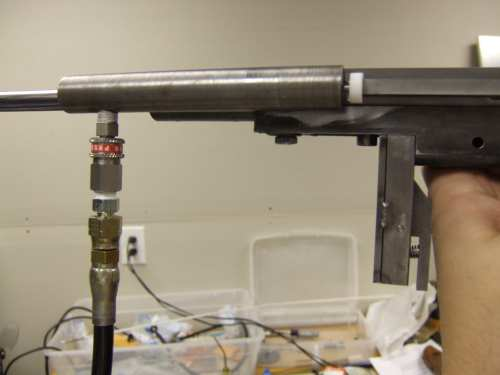

Air Supply for the Caselman was modified from an onboard tank to a tethered supply.  This was done in anticipation of a lot of testing and modifications and I didn't want to spend a lot of time filling a tank.  I can now run this off the scuba tank for a long time.  For field use a smaller air tank can be used.

Testing was done with a 3000 psi scuba tank.

The white disk in the picture at the back of the valve body is the valve travel limiter used for testing.  You can find more about them on the valve page.