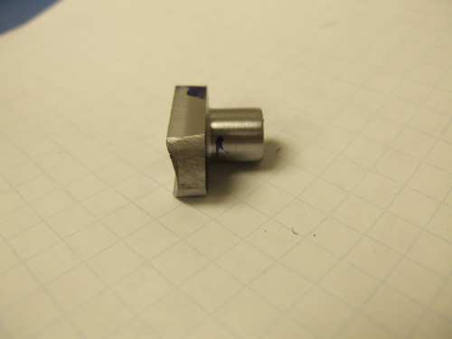

Barrel holder showing the chamber end, ammo feed port, 
and the small hole in the larger diameter which is for the
barrel holding set screws.

This section covers the barrel, the barrel holder, and the ammo port.  All of these parts have been redesigned to allow for caliber changes and the use of round ball lead ammo.  There are several new parts here.  I will get the drawings uploaded.

The barrel is a .32-20 barrel liner that has a 1/2" outside diameter and 20" long.  It is held in the barrel holder with two 8-32 set screws.  With this design it is easy to change barrels as the chamber is in the barrel holder.  It is made so the bolt nose pushes the round ball just up to the back of the barrel, and into the start of the rifling a tiny bit.

The ammo port was cut from a 3/4" round bar of 12L14 in the lathe and finished on the mill.  The bottom of it is radiused to match the 3/4" OD of the barrel holder.

Ammo Port showing radius to fit the barrel holder.