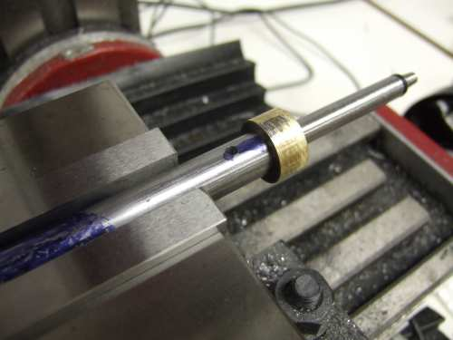
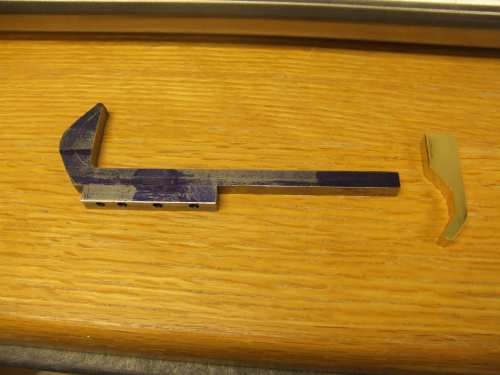

The striker (along with the bolt), as shown above is way too light!  Initial testing had firing rates of 1200 to 1500 rpm.  It can be tuned to fire reliable at 1200 rpm with the regular striker spring.  I chose to slow it down to 800 rpm as that is a good compromise of ROF and reliability, and just sounds good.  Stay tuned for more about how to fix this issue.

The brass overlay can be removed.  Laying in brazing didn't work very well, so I just machined a piece of brass rod and soldered and pinned it in place.  I think a better solution is to machine the front bolt part out of 12L14 and eliminate the brass overlay.