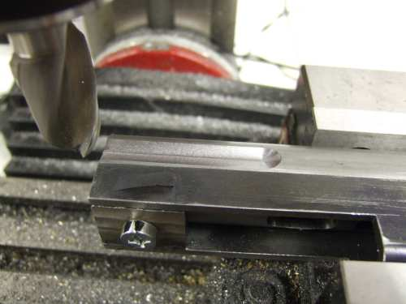
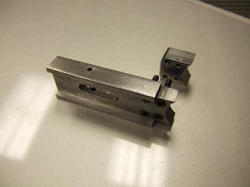
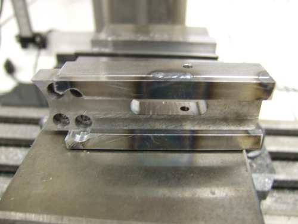

# Caselman Website Pages

## Caselman Parts List

- CR - Cold Roll Steel
- MW - Music Wire
- 01 - Oil Harden Tool Steel or use A2 tool steel so it can be brazed after hardening.

1.  Firing Valve - CR
2.  Firing Valve Stem - Modified to 1/8" diameter by 1 1/2" long dowel Pin
3.  Firing Valve Seat - Ultra high molecular weight polyethylene (UHMW)
4.  Firing Valve Body - CR
5.  Firing Valve Air Holding Area - CR
6.  Firing Valve Spring - MW
7.  Firing Valve Spring Guide - 22 gauge. - CR
8.  Firing Valve 0 Ring
9.  Striker - 01 or - CR
10. Cocking Pin-Concrete Nail etc.
11. Cocking Pin Retaining Roll Pin - 1/16" diameter roll pin
12. Striker Screws 6-32 (modified for 3)
13. Striker Follower - Drawn Over Mandrel (D.O.M.) steel tube
14. Striker Follower Sear - 01
15. Striker Spring - MW
16. Striker Buffer - UHMW
17. Bolt - 01 or - CR
18. Bolt Body - D.O.M. steel tube
19. Bolt 0 Ring - 5/16 by 3/16 by 1/16
20. Bolt Pins - 3/32 Roll Pins 1/2 long 
21. Bolt Spring - MW
22. Spring Follower - CR
23. Breech Plug - CR
24. Breech Plug Screw-1/4 28
25. Receiver - D.O.M. Mechanical Tube
26. Barrel - .32-20 caliber barrel liner 1/2" OD, 20" long.
27. Barrel Screw & Front Grip Body - 1/4 28 (2) 
28. Trigger Housing - 1 by 1 1/8 by 1/8 Rectangular Tube
29. Trigger Housing Mounting Block Rear - CR
30. Trigger Housing Mounting Block Front - CR
31. Trigger Housing Screws - 10-32 (2)
32. Trigger Guard - CR
33. Trigger - CR
34. Trigger Frame Block - CR
35. Trigger Stop Screw Adjust - 10-32 by 1/2
36. Trigger Stop Screw Set nut - 10-32
37. Trigger Pivot Pin-Dowel Pin 1/8 by 1” (2)
38. E-Clip Spacers  – Prefer to use a machined bushing
39. Trigger Spring-Torsion-MW
40. Full Auto Sear Trip - 01
41. Full Auto Sear Trip Pin - Dowel Pin 1/8" by 5/8" long
42. Full Auto Sear Trip Spacer – CR
43. Sear Spring – MW
44. Disconnector - 01
45. Sear - 01
46. Sear Spring – MW
47. Sear Stop Screw & Set Nuts - 6-32
48. Magazine Housing - CR
49. Magazine Release - CR
50. Magazine Release Pin - Dowel Pin 1/8" by 1" long
51. Magazine Release Spring – MW
52. Tank Shoulder Pad – Optional 
53. Tank Mount - CR
54. Tank Mount 0 ring - 3/4 X 9/16 X 3/32
55. Tank Mount To Firing Valve Fittings (2) –
56. Airline - 1/4 X 3/16 Tube –
57. Tank 
58. Threaded Nipple
59. Valve Stem -  0 ring
60. Cocking Pin Spring - MW
61. Rear Grip Body - CR
62. Rear Grips - Plastic
63. Front Grip Body - CR
64. Front Grip Body Ring - Tube
65. Front Grip Body Strap - CR
66. Front Grips - Plastic
67. Grip Screws Male & Female
68. Magazine – CR –or - Nylon
69. Magazine Rear Plate – CR
70. Magazine Bullet Holders Left & Right – 01 – * Not Shown
71. Magazine Follower – Plastic – * Not Shown
72. Magazine Follower Spring – MW – * Not Shown

## Valve

The Firing Valve Body is made of cold rolled steel.  The picture shows the turned parts before the Firing Valve Body was welded to the receiver tube.  The plans call for a 3/32" diameter valve stem, but this version was built with a 1/8" diameter valve stem.

The o-ring sealing surfaces should be carefully machined and smoothed to make sure the o-ring seals fully.  The valve body shown above was tested prior to drilling the 1/8" valve stem hole, then again once the valve stem hole was drilled and the valve and valve seat installed.  It should seal bubble tight.

The hole in the Air Holding Area for the air input can be drilled and tapped before the valve body is welded to the receiver tube.  However, if that is the case, that hole must be properly aligned (with the two parts joined together) to get the proper orientation when the valve body is welded to the receiver tube.

A valve stem travel limiter was machined from a piece of delrin.  Actually, I made 4 of them, each with a difference thickness, to limit the travel of the valve stem when hit by the striker.  They are just pressed on the valve stem.  They worked well.  Once you are happy with the valve travel and overall performance level, the valve stem can be cut to the final length and the limiters are no longer needed.

## Receiver

The receiver tube is made from 1" OD, .120" wall DOM steel tube.  The slot being machined in the picture above was later modified for round ball ammo and the new magazine and ammo port.

A ball end mill is used to cut the groove where the valve body is welded on to the receiver tube.

A lot of people don't notice that the Caselman was built left handed.  My second version is right handed.  Cut the slot for the striker on the right side.  You will also make changes in the striker follower and the bolt body, but there isn't anything too difficult about making it right handed. 

There isn't anything difficult in building the receiver tube.

## Housings

The Trigger housing is made from a piece of square or rectangular steel tube.  The top is cut out or off the the tube.  The one shown here was made by cutting the top off of a 1" wide by 1 1/2" tall by .125" wall steel tube with a band saw.  The rough cut for the magazine area was also cut on a bandsaw.  The top was machined with a 1" ball end mill so it would mate up to the 1" receiver tube.  Be prepared for the cut tube to distort as the internal stresses are relieved.  The cutout for the magazine well was done with the front radius piece tacked in place, then the cut was cleaned up with the mill.

The magazine well was redesigned to make it removable.  This was done for several reasons.  I wanted to be able to alter the attachment part for various magazine designs including a drum magazine.  It was also much easier to build in multiple pieces.

The rest of the construction was straight forward.

## Magazines

The original magazine design for the Caselman was for conical bullets and required a forming die and oval spring.  The magazine and loading port were redesigned to shoot round ammo.  The new magazine is simple to build but still reliably feeds .32 caliber, 45 grain, round ball ammo.

The magazine housing was redesigned to use the flat 1/8" backplate of the new magazine.  A spacer of 1/8" thick plate is used.  The two parts are welded together then a saw cut is made down the centerline for 1.500".  Two 8-32 holes are drilled and tapped to hold the straight music wire 

The magazine tube is made of steel tube .500" outside diameter by .375" by 14" long.  It will hold more than 30 rounds depending on the spring pitch and follower length.  The end of the tube is tapped with a 1/8"x27 NPT thread.  The end plug of the magazine is a 1/8" pipe plug.  The top end is bored out to .400" inside diameter by about .300" deep for clearance over the ammo port.

The magazine spring was wound with .021" diameter music wire using a 1/4" diameter rod and a hand drill.  A pitch tool was made from a piece of copper wire.  Wind the spring about 2" longer than the magazine.  The spring is then baked in the oven at 500 degrees for about 30 minutes.

The first magazine was soldered together, so that is an option.  Additional magazines were TIG welded. The position of the center line of the magazine tube relative to the back plate of the magazine is important for the proper fit and alignment with the ammo port and should be .500".

The follower is made from Delrin according to the drawing.  The longer length ensures that all rounds will fire, at the cost of three less rounds in magazine capacity.  

## Bolt and Striker

The striker (along with the bolt), as shown above is way too light!  Initial testing had firing rates of 1200 to 1500 rpm.  It can be tuned to fire reliable at 1200 rpm with the regular striker spring.  I chose to slow it down to 800 rpm as that is a good compromise of ROF and reliability, and just sounds good.  Stay tuned for more about how to fix this issue.

The brass overlay can be removed.  Laying in brazing didn't work very well, so I just machined a piece of brass rod and soldered and pinned it in place.  I think a better solution is to machine the front bolt part out of 12L14 and eliminate the brass overlay.

## Barrel

Barrel holder showing the chamber end, ammo feed port, 
and the small hole in the larger diameter which is for the
barrel holding set screws.

This section covers the barrel, the barrel holder, and the ammo port.  All of these parts have been redesigned to allow for caliber changes and the use of round ball lead ammo.  There are several new parts here.  I will get the drawings uploaded.

The barrel is a .32-20 barrel liner that has a 1/2" outside diameter and 20" long.  It is held in the barrel holder with two 8-32 set screws.  With this design it is easy to change barrels as the chamber is in the barrel holder.  It is made so the bolt nose pushes the round ball just up to the back of the barrel, and into the start of the rifling a tiny bit.

The ammo port was cut from a 3/4" round bar of 12L14 in the lathe and finished on the mill.  The bottom of it is radiused to match the 3/4" OD of the barrel holder.

Ammo Port showing radius to fit the barrel holder.

## Trigger

Here are some pictures and tips on making the trigger function on the Caselman.

I didn't like the trigger setup when I first started building.  It looked like there would be a problem with wear where the soft bolt rides across the top of the hardened full-auto sear trip.  I made a mock up of the parts from cardboard to see how all of the parts interact.  It didn't appear that there would be enough trigger travel to get it into full-auto mode.  It bottomed out on the bottom of the trigger housing.  I wasn't concerned with a semi-auto mode, preferring trigger control and mostly full-auto firing anyway.  I quickly designed and built a full-auto only trigger connector.  You will see pictures of that on here.  I also did a few other options, but eventually decided to try the original design.  With careful measurements, some more filing and grinding, and final fitting I got enough travel.  Email me and I will send you the details on the trigger setup and measurements.  It will eventually be on this site.

Email me with any questions about how the trigger operates and I will post answers and more pictures here.

## Air Supply

Air Supply for the Caselman was modified from an onboard tank to a tethered supply.  This was done in anticipation of a lot of testing and modifications and I didn't want to spend a lot of time filling a tank.  I can now run this off the scuba tank for a long time.  For field use a smaller air tank can be used.

Testing was done with a 3000 psi scuba tank.

The white disk in the picture at the back of the valve body is the valve travel limiter used for testing.  You can find more about them on the valve page.

## Assembly

_webpage incomplete_

## Testing

_webpage incomplete_