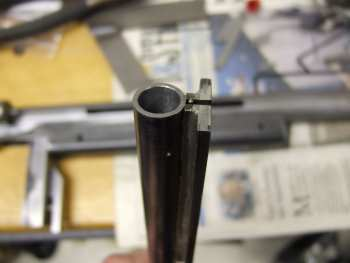

The original magazine design for the Caselman was for conical bullets and required a forming die and oval spring.  The magazine and loading port were redesigned to shoot round ammo.  The new magazine is simple to build but still reliably feeds .32 caliber, 45 grain, round ball ammo.

The magazine housing was redesigned to use the flat 1/8" backplate of the new magazine.  A spacer of 1/8" thick plate is used.  The two parts are welded together then a saw cut is made down the centerline for 1.500".  Two 8-32 holes are drilled and tapped to hold the straight music wire 

The magazine tube is made of steel tube .500" outside diameter by .375" by 14" long.  It will hold more than 30 rounds depending on the spring pitch and follower length.  The end of the tube is tapped with a 1/8"x27 NPT thread.  The end plug of the magazine is a 1/8" pipe plug.  The top end is bored out to .400" inside diameter by about .300" deep for clearance over the ammo port.

The magazine spring was wound with .021" diameter music wire using a 1/4" diameter rod and a hand drill.  A pitch tool was made from a piece of copper wire.  Wind the spring about 2" longer than the magazine.  The spring is then baked in the oven at 500 degrees for about 30 minutes.

The first magazine was soldered together, so that is an option.  Additional magazines were TIG welded. The position of the center line of the magazine tube relative to the back plate of the magazine is important for the proper fit and alignment with the ammo port and should be .500".

The follower is made from Delrin according to the drawing.  The longer length ensures that all rounds will fire, at the cost of three less rounds in magazine capacity.  