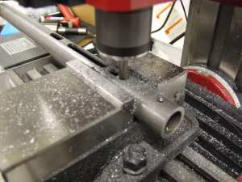

The receiver tube is made from 1" OD, .120" wall DOM steel tube.  The slot being machined in the picture above was later modified for round ball ammo and the new magazine and ammo port.

A ball end mill is used to cut the groove where the valve body is welded on to the receiver tube.

A lot of people don't notice that the Caselman was built left handed.  My second version is right handed.  Cut the slot for the striker on the right side.  You will also make changes in the striker follower and the bolt body, but there isn't anything too difficult about making it right handed. 

There isn't anything difficult in building the receiver tube.