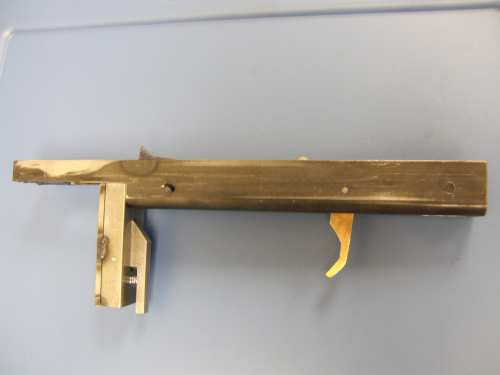
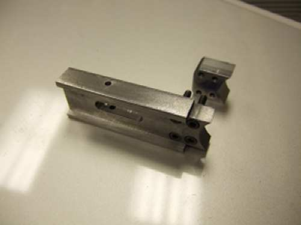
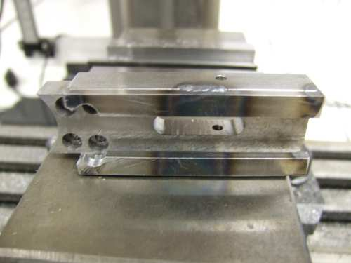

The Trigger housing is made from a piece of square or rectangular steel tube.  The top is cut out or off the the tube.  The one shown here was made by cutting the top off of a 1" wide by 1 1/2" tall by .125" wall steel tube with a band saw.  The rough cut for the magazine area was also cut on a bandsaw.  The top was machined with a 1" ball end mill so it would mate up to the 1" receiver tube.  Be prepared for the cut tube to distort as the internal stresses are relieved.  The cutout for the magazine well was done with the front radius piece tacked in place, then the cut was cleaned up with the mill.

The magazine well was redesigned to make it removable.  This was done for several reasons.  I wanted to be able to alter the attachment part for various magazine designs including a drum magazine.  It was also much easier to build in multiple pieces.

The rest of the construction was straight forward.