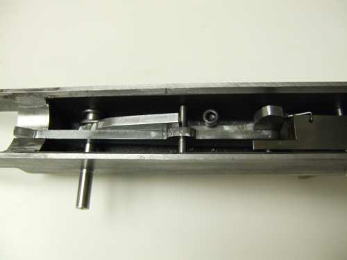

Here are some pictures and tips on making the trigger function on the Caselman.

I didn't like the trigger setup when I first started building.  It looked like there would be a problem with wear where the soft bolt rides across the top of the hardened full-auto sear trip.  I made a mock up of the parts from cardboard to see how all of the parts interact.  It didn't appear that there would be enough trigger travel to get it into full-auto mode.  It bottomed out on the bottom of the trigger housing.  I wasn't concerned with a semi-auto mode, preferring trigger control and mostly full-auto firing anyway.  I quickly designed and built a full-auto only trigger connector.  You will see pictures of that on here.  I also did a few other options, but eventually decided to try the original design.  With careful measurements, some more filing and grinding, and final fitting I got enough travel.  Email me and I will send you the details on the trigger setup and measurements.  It will eventually be on this site.

Email me with any questions about how the trigger operates and I will post answers and more pictures here.